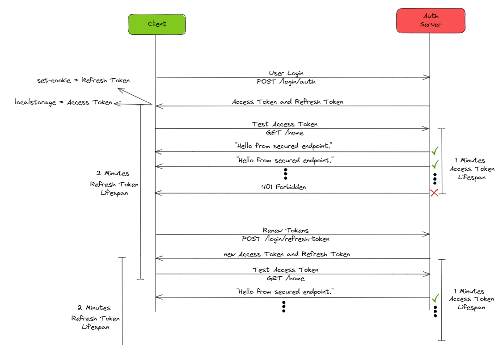

# Spring Boot JWT Auth With Refresh Token

### Flow Chart


### Application Logic
- User sends username and password to the server
- Server validates the credentials and sends back an Access Token and Refresh Token
- User stores the Access Token in local storage and Refresh Token in a cookie
- User sends the Access Token in the Authorization header of every request
- Server validates the Access Token and sends back the response
- If the Access Token is expired, user sends the Refresh Token in the Cookie header of the request
- Server validates the Refresh Token and sends back a new Access Token and Refresh Token

## Files
- [Postman Collection](SpringJWTSecurity.postman_collection.json)
- [Application Properties](src/main/resources/application.properties)

## Technologies
- Java 17
- Spring Boot 3.0
- Spring Data JPA
- Spring Security
- IO JSON Web Token
- H2 Database
- Lombok
- Restful API
- Maven

## Maven Run
To build and run the application with `Maven`, please follow the directions below;

```sh
$ cd spring_jwt_auth_with_refresh
$ mvn clean install
$ mvn spring-boot:run
```